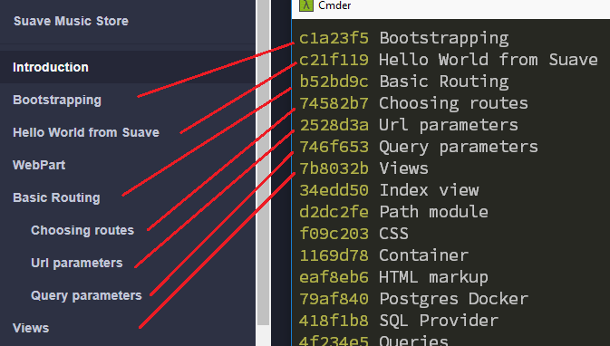

# Contribution Guidelines

Usually you'd find a single **master** / **main** branch for a repository.
This repository for the tutorial is exceptional, because there are 2 **completely separate** branches:

* First one, named [contents](https://github.com/theimowski/SuaveMusicStore/tree/contents) (where this contribution guideline is located) contains contents for the tutorial,
* Second one, prefixed with `src_v` contains source code for the tutorial and has a linear git history.

Thanks to the linear git history, one is able to track all the relevant changes in the tutorial to keep up to date.
Each commit from the source branch has a single-line commit message with a title for corresponding section in the tutorial.
Then the section can include code snippets from that commit.

Following is an illustration of the reference:

A section doesn't have to its corresponding commit (like Introduction or WebPart), but each commit must have its corresponding contents section.

## If you'd like to contribute to:

### The contents of the tutorial

please send pull request to the `contents` branch as you'd normally do.

### The source of the tutorial

please send pull request to the most current branch prefixed with `src_v`. After the Pull reqest is accepted, I'll squash the merged commit to `contributions` section (at the end of tutorial) and force push the branch to refresh the source code.